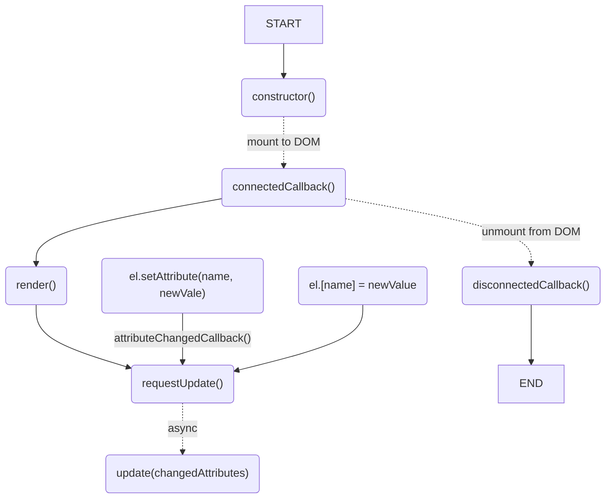

**Table of contents**

<!-- !toc (minlevel=2) -->

* [constructor()](#constructor)
* [connectedCallback()](#connectedcallback)
* [disconnectedCallback()](#disconnectedcallback)
* [attributeChangedCallback(name, oldValue, newValue)](#attributechangedcallbackname-oldvalue-newvalue)
* [Update Cycle](#update-cycle)
* [Form-Associated Elements](#form-associated-elements)
* [render()](#render)
* [update(changedAttributes)](#updatechangedattributes)
* [shouldUpdate(changedAttributes)](#shouldupdatechangedattributes)
* [on(eventName, listener, \[node\])](#oneventname-listener-node)
* [once(eventName, listener, \[node\])](#onceeventname-listener-node)

<!-- toc! -->

# Element Lifecycle

MiElement components use the [standard custom element lifecycle callbacks][].

[standard custom element lifecycle callbacks]: https://developer.mozilla.org/en-US/docs/Web/API/Web_components/Using_custom_elements#custom_element_lifecycle_callbacks

## constructor()

Called whenever a new element is created. Default attributes are being applied
from the `static attributes` object. From there setters and getters for property
changes using `.[name] = newValue` instead of `setAttribute(name, newValue)` are
applied.


```js
class extends MiElement {
  /**
   * Declare observable attributes with this getter. 
   * Use `true` to define boolean attributes!
   * Do not use `static attribute = { text: false }` as components attributes 
   * will use a shallow copy only. With the getter we always get a real "deep" 
   * copy.
   * 
   * Avoid using attributes which are HTMLElement properties e.g. `className`.
   * camelCased attributes will be made observable using its kebab-cased name.
   */
  static get properties () {
    return {
      text: {},
      focus: { type: Boolean },
      // define property only
      numberPropOnly: { attribute: false, type: Number }
    }
  }

  /**
   * optionally declare "non observable" or internal properties
   */
  foo = 'foo'
}
```

## connectedCallback()

Invoked when a component is being added to the document's DOM.

Micro components create `this.renderRoot` (typically same as `this.shadowRoot`
for open components) using `this.attachShadow(shadowRootInit)`. Shadow root
options are taken from the components `static shadowRootInit = { mode: 'open'
}`. In advanced cases where no shadow root is desired, set `static
shadowRootInit = null`

The most common use case is adding event listeners to external nodes in
`connectedCallback()`. Typically, anything done in `connectedCallback()` should
be undone when the element is disconnected, like removing all event listeners on
external nodes to prevent memory leaks.

Then the first `render()` is issued with a `requestUpdate()`

```js
class extends MiElement {
  // { mode: 'open' } is the default shadow root option 
  // use `null` for no shadow root or { mode: 'closed' } for closed mode
  static shadowRootInit = { mode: 'open' }

  connectedCallback() {
    super.connectedCallback() // don't forget to call the super method
    window.addEventListener('keydown', this._handleKeyDown)
  }

  // create a event listener which is bound to this component
  // note the `_listener () => {}` syntax (instead of `_listener () {}`)
  _handleKeyDown = (ev) => {
    // do sth. with the event
  }

  disconnectedCallback() {
    super.disconnectedCallback()
    window.removeEventListener('keydown', this._handleKeyDown)
  }
}
```

To simplify further use `this.on()` which automatically removes the event listener
on `window` when the component is unmounted with `disconnectedCallback()`.

```js
class extends MiElement {
  connectedCallback() {
    super.connectedCallback()
    this.on('keydown', this._handleKeyDown, window)
  }

  // create a event listener which is bound to this component
  // note the `_listener () => {}` syntax (instead of `_listener () {}`)
  _handleKeyDown = (ev) => {
    // do sth. with the event
  }
}
```

## disconnectedCallback()

Invoked when a component is removed from the document's DOM.

Typically, anything done in `connectedCallback()` should be undone when the
element is disconnected, like removing all event listeners on external nodes to
prevent memory leaks.

See previous example.

!!! INFO No need to remove internal event listeners

    You don't need to remove event listeners added on the component's own
    DOM. This includes those added in your template. Unlike external
    event listeners, these will be garbage collected with the component.

## attributeChangedCallback(name, oldValue, newValue)

Invoked when one of the element’s observedAttributes changes.

Usually no need to do something here. But if, don't forget to call
`super.attributeChangedCallback(name, oldValue, newValue)` within.

## Update Cycle



A micro component usually implements `render()` and `update()`:

```js
import { define, MiElement, refsBySelector } from 'mi-element'

class Counter extends MiElement {
  static get properties() {
    return { value: { type: Number } }
  }

  // define the innerHTML template for the component
  static template = `
  <button>Count</button>
  <p>Counter value: <span>0</span></p>
  `

  render() {
    // If `static template` is provided, it has already been rendered
    // on `this.renderRoot`

    // obtain references for events and update() with `refsBySelector`
    this.refs = refsBySelector(this.renderRoot, {
      button: 'button',
      count: 'span'
    })

    // apply event listener on button
    this.refs.button.addEventListener('click', () => {
      // observed attribute will trigger `requestUpdate()` which then async
      // calls `update()`
      this.value++
    })
  }

  update() {
    this.refs.count.textContent = this.value
  }
}
```

## Form-Associated Elements

MiElement supports [form-associated custom elements][form-associated], allowing
your components to participate in HTML forms just like native form controls.

[form-associated]: https://web.dev/articles/form-associated-custom-elements

### Declaring a Form-Associated Element

Set `static formAssociated = true` on your component to enable form association:

```js
import { define, MiElement, html } from 'mi-element'

class CustomInput extends MiElement {
  static formAssociated = true

  static get properties() {
    return {
      name: { type: String },
      value: { type: String, initial: '' }
    }
  }

  static template = html`<input type="text" />`
  
  render() {
    this.refs = this.refsBySelector({ input: 'input' })
    this.refs.input.addEventListener('input', (ev) => {
      this.value = ev.target.value
    })
  }
}

define('custom-input', CustomInput)
```

### Handling Form Data

Implement the `handleFormdata(ev)` method to submit your component's data with
the form:

```js
class CustomInput extends MiElement {
  static formAssociated = true

  // ...other code...

  handleFormdata(ev) {
    // Only include data if the component has a name attribute
    if (this.name) {
      ev.formData.append(this.name, this.refs.input.value)
    }
  }
}
```

The `handleFormdata` method is automatically called when the form is submitted or
when `FormData` is created from the form.

### Usage Example

```html
<form id="my-form">
  <custom-input name="username" value="john"></custom-input>
  <custom-input name="email" value="john@example.com"></custom-input>
  <button type="submit">Submit</button>
</form>

<script>
  const form = document.getElementById('my-form')
  const formData = new FormData(form)
  
  console.log(formData.get('username')) // 'john'
  console.log(formData.get('email'))    // 'john@example.com'
</script>
```


## render()

Initial rendering of the component. Try to render the component only once!

Within the `render()` method, bear in mind to:

- Avoid changing the component's state.
- Avoid producing any side effects.
- Use only the component's properties as input.

!!! WARNING XSS - Cross-Site Scripting
    
    Using [`innerHTML`][innerHTML] to create the components DOM is susceptible to
    [XSS][XSS] attacks in case that user-supplied data contains valid HTML markup.

In all other cases you may consider the <code>html``</code> template literal or
`escHtml()` from the "mi-element" import, which escapes user-supplied data.

[innerHTML]: https://developer.mozilla.org/en-US/docs/Web/API/Element/innerHTML
[XSS]: https://en.wikipedia.org/wiki/Cross-site_scripting

```js
import { define, MiElement } from 'mi-element'

// (1) get template directly from html ...
const template = document.querySelector('template#counter')

// (2) or define outside the component ...
const template = document.createElement('template')
template.innerHTML = `
<button>Count</button>
<p>Counter value: <span>0</span></p>
`

class Counter extends MiElement {
  // (3) or as static string on the component (needs define from 'mi-element')
  static template = `
  <button id>Count</button>
  <p>Counter value: <span id="count">0</span></p>
  `
  // ...
  render() {
    /*
    // NEVER DO THIS, as this may cause XSS ///
    this.renderRoot.innerHTML = `
      <button>Count</button>
      <p>Counter value: <span>${this.count}</span></p>`
    */
    // always render a cloned template, which is safe
    // NOT NEEDED with option (3) `static template = '...'`
    this.addTemplate(template)
  }
}

// always use define with (3)
define('mi-element-counter', Counter)
```

To more easily obtain any references of interest use the `refs()` helper by
adding `id` attributes to the nodes where updates shall happen or event
listeners must be applied.

```js
import { MiElement, define } from 'mi-element'

class Counter extends MiElement {
  static template = `
  <button id>Count</button>
  <p>Counter value: <span>0</span></p>
  ``

  render() {
    // template is already rendered on `this.renderRoot`

    // get refs though `refsBySelector`
    this.refs = this.refsBySelector({ button: 'button', count: 'p > span'})
    // this.refs == {button: <button>, count: <span>}
  }
}

define('mi-element-counter', Counter)
```

## update(changedAttributes)

Here all content or render updates on the component should happen. Avoid
re-rendering the full component and only apply partial changes on the
rendered elements as much as possible.

```js
class Counter extends MiElement {
  render() {
    // ...
    this.update()
  }

  // ...
  update() {
    this.refs.count.textContent = this.value
  }
}
```

In order to allow judged decisions on the area where an update should take place
any changed attributes are passed.

To mitigate [XSS][] attacks prefer the use of `.textContent` and avoid
~~`.innerHTML`~~. For attribute changes use `.setAttribute(name, newValue)`.

For finer control on updates the use of signals is encouraged. With this there
is no need to add logic to `update()`.

```js
import { MiElement, Signal } from 'mi-element'

class Counter extends MiElement {
  static get properties() {
    return { 
      value: { type: Number } 
     }
  }

  static template = `
  <button>Count</button>
  <p>Counter value: <span>0</span></p>
  `

  constructor() {
    super()
    // set initial values
    this.value = 0
  }


  render() {
    const refs = this.refsBySelector({
      button: 'button',
      count: 'span'
    })

    refs.button.addEventListener('click', () => {
      this.value++
    })

    Signal.effect(() => {
      // an update only happens if `this.value` changes; 
      // other attribute changes are ignored.
      refs.count.textContent = this.value
    })
  }
}
```

## on(eventName, listener, \[node\])

Adds listener function for eventName. listener is removed before component
disconnects.

```js
class Router extends MiElement {
  render() {
    // add event listener 'hashchange' to `window` which is disposed as soon as 
    // the component unmounts
    this.on('hashchange', this.update, window)
  }
  // ...
}
```

## once(eventName, listener, \[node\])

Adds one-time listener function for eventName. The next time eventName is
triggered, this listener is removed and then invoked.
