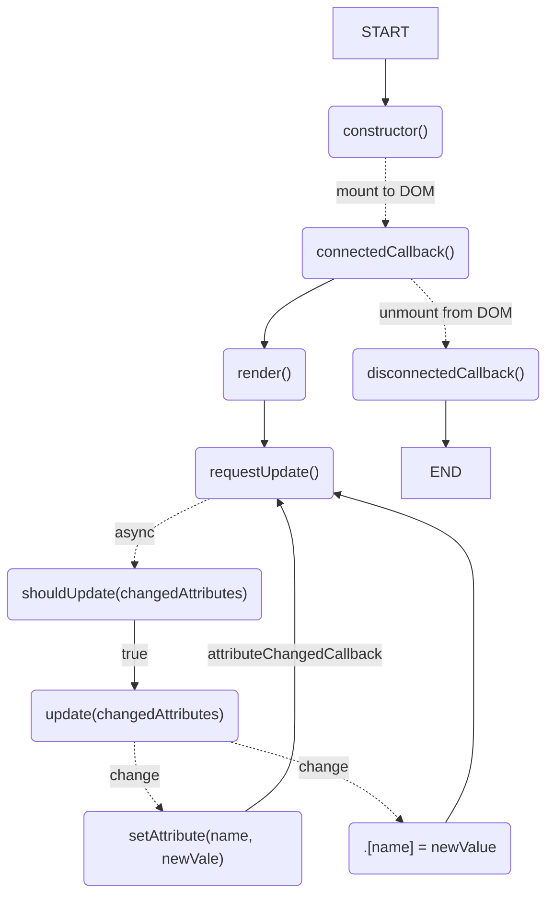

# Lifecycle

MiElement components use the [standard custom element lifecycle callbacks][].

[standard custom element lifecycle callbacks]: https://developer.mozilla.org/en-US/docs/Web/API/Web_components/Using_custom_elements#custom_element_lifecycle_callbacks

## constructor()

Called whenever a new element is created. Default attributes are being applied
from the `static attributes` object. From there setters and getters for property
changes using `.[name] = newValue` instead of `setAttribute(name, newValue)` are
applied.

```js
class extends MiElement {
  /**
   * Declare observable attributes and their default values with getter.
   * Avoid `static attribute = { text: 'Hi' }` as components attributes will use
   * a shallow copy only. With the getter we always get a real "deep" copy.
   */
  static get attributes () {
    return {
      text: 'Hi'
    }
  }

  constructor() {
    super()
    // optionally declare "non observable" and internal properties
    this.foo = 'foo'
  }
}
```

## connectedCallback()

Invoked when a component is being added to the document's DOM.

Micro components create `this.renderRoot` (typically same as `this.shadowRoot`
for open components) using `this.attachShadow(shadowRootOptions)`. Shadow root
options are taken from the components `static shadowRootOptions = { mode: 'open'
}`. In advanced cases where no shadow root is desired, set `static
shadowRootOptions = null`

The most common use case is adding event listeners to external nodes in
`connectedCallback()`. Typically, anything done in `connectedCallback()` should
be undone when the element is disconnected, like removing all event listeners on
external nodes to prevent memory leaks.

Then the first `render()` is issued with a `requestUpdate()`

```js
class extends MiElement {
  // this is the default shadow root option
  static shadowRootOptions = { mode: 'open' }

  connectedCallback() {
    super.connectedCallback() // don't forget to call the super method
    window.addEventListener('keydown', this._handleKeyDown)
  }

  // create a event listener which is bound to this component
  // note the `_listener () => {}` syntax (instead of `_listener () {}`)
  _handleKeyDown = (ev) => {
    // do sth. with the event
  }

  disconnectedCallback() {
    super.disconnectedCallback()
    window.removeEventListener('keydown', this._handleKeyDown)
  }
}
```

To simplify further use `this.on()` which automatically removes the event listener
on window when component is unmounted with `disconnectedCallback()`.

```js
class extends MiElement {
  connectedCallback() {
    super.connectedCallback()
    this.on('keydown', this._handleKeyDown, window)
  }

  // create a event listener which is bound to this component
  // note the `_listener () => {}` syntax (instead of `_listener () {}`)
  _handleKeyDown = (ev) => {
    // do sth. with the event
  }
}
```

## disconnectedCallback()

Invoked when a component is removed from the document's DOM.

Typically, anything done in `connectedCallback()` should be undone when the
element is disconnected, like removing all event listeners on external nodes to
prevent memory leaks.

See previous example.

!!! INFO No need to remove internal event listeners

    You don't need to remove event listeners added on the component's own
    DOM. This includes those added in your template. Unlike external
    event listeners, these will be garbage collected with the component.

## attributeChangedCallback(name, oldValue, newValue)

Invoked when one of the element’s observedAttributes changes.

Usually no need to do something here. But if, don't forget to call
`super.attributeChangedCallback(name, oldValue, newValue)` within.

## Update Cycle



A micro component usually implements `render()` and `update()`:

```js
import { define, MiElement, refsBySelector } from 'mi-element'

class Counter extends MiElement {
  static get attributes() {
    return { value: 0 }
  }

  // define the innerHTML template for the component
  static template = `
  <button>Count</button>
  <p>Counter value: <span>0</span></p>
  `

  render() {
    // If `static template` is provided, it has already been rendered
    // on `this.renderRoot`

    // obtain references for events and update() with `refsBySelector`
    this.refs = refsBySelector(this.renderRoot, {
      button: 'button',
      count: 'span'
    })

    // apply event listener on button
    this.refs.button.addEventListener('click', () => {
      // observed attribute will trigger `requestUpdate()` which then async
      // calls `update()`
      this.value++
    })
  }

  update() {
    this.refs.count.textContent = this.value
  }
}
```

## render()

Initial rendering of the component. Try to render the component only once!
If you need re-rendering by recrating the DOM do this outside of `render()`

Within the `render()` method, bear in mind to:

- Avoid changing the component's state.
- Avoid producing any side effects.
- Use only the component's attributes as input.

Using [`innerHTML`][innerHTML] to create the components DOM is susceptible to
[XSS][XSS] attacks in case that user-supplied data contains valid HTML markup.

In all other cases you may consider <code>esc``</code>, `escHtml()`or`escAttr()`
from the "mi-element" import, which escapes user-supplied data.

[innerHTML]: https://developer.mozilla.org/en-US/docs/Web/API/Element/innerHTML
[XSS]: https://en.wikipedia.org/wiki/Cross-site_scripting

```js
import { define, MiElement } from 'mi-element'

// (1) get template directly from html ...
const template = document.querySelector('template#counter')

// (2) or define outside the component ...
const template = document.createElement('template')
template.innerHTML = `
<button>Count</button>
<p>Counter value: <span>0</span></p>
`

class Counter extends MiElement {
  // (3) or as static string on the component (needs define from 'mi-element')
  static template = `
  <button id>Count</button>
  <p>Counter value: <span id="count">0</span></p>
  `
  // ...
  render() {
    /*
    /// NEVER DO THIS, as this may cause XSS ///
    this.renderRoot.innerHTML = `
      <button>Count</button>
      <p>Counter value: <span>${this.count}</span></p>`
    */
    // always render a cloned template, which is safe
    // NOT NEEDED with option (3) `static template = '...'`
    this.addTemplate(template)
  }
}

define('mi-element-counter', Counter)
```

To more easily obtain any references of interest use the `refs()` helper by
adding `id` attributes to the nodes where updates shall happen or event
listeners must be applied.

```js
import { MiElement, define, refsById } from 'mi-element'

class Counter extends MiElement {
  static template = `
  <button id>Count</button>
  <p>Counter value: <span id="count">0</span></p>
  `

  render() {
    // template is already rendered on `this.renderRoot`

    // get refs though `refsById` of `refsBySelector`
    this.refs = refsById(this.renderRoot)
    // this.refs == {button: <button>, count: <span>}
  }
}

define('mi-element-counter', Counter)
```

## update(changedAttributes)

Here all content or render updates on the component should happen. Avoid
re-rendering the full component and only apply partial changes on the
rendered elements as much as possible.

```js
class Counter extends MiElement {
  // ...
  update() {
    this.refs.count.textContent = this.value
  }
}
```

In order to allow judged decisions on the area where an update should take place
any changed attributes are passed.

To mitigate [XSS][] attacks prefer the use of `.textContent` and avoid
~~`.innerHTML`~~. For attribute changes use `.setAttribute(name, newValue)`.
Both `.textContent` and `setAttribute()` provide escaping for you.

## shouldUpdate(changedAttributes)

Conveniance method in order to be able to decide on the changed attributes,
whether `update()` should be called or not.
